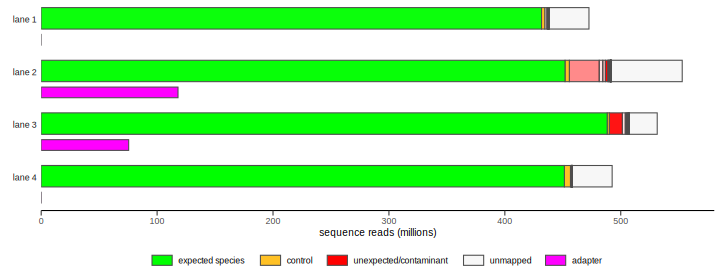

# Multi-genome alignment (MGA) contaminant screen for DNA/RNA sequencing data

MGA is a quality control tool for high-throughput sequencing data. It screens
for contaminants by aligning sequence reads in FASTQ format to a series of
reference genomes using [bowtie](http://bowtie-bio.sourceforge.net/index.shtml)
and to a set of adapter sequences using
[exonerate](https://www.ebi.ac.uk/about/vertebrate-genomics/software/exonerate).

MGA samples a subset of the reads, by default 100000, prior to alignment against
reference genome sequences and adapters, providing a fast screen for unexpected
sequence content by limiting the computational effort. Sequence reads are trimmed
to 36 bases by default, prior to alignment to the reference genomes, with the
aim of minimizing the run time and ensuring consistency of the resulting mapping
and error rates across sequencing runs with differing read lengths. Full length
reads are used for matching adapter sequences to pick up adapter read-through
for DNA/RNA fragments that are shorter than the read length.

mga2 is a rewrite of the original [MGA](https://github.com/crukci-bioinformatics/MGA)
in which the workflow has been ported to [Nextflow](https://www.nextflow.io/index.html),
sampling of FASTQ records (the rate limiting step for very large datasets such
as NovaSeq S4 flow cells) has been rewritten in Rust, and summarization and
plotting have been rewritten using R. mga2 was developed by the
[Bioinformatics Core](https://www.cruk.cam.ac.uk/core-facilities/bioinformatics-core)
at the [Cancer Research UK Cambridge Institute](https://www.cruk.cam.ac.uk/)
(CRUK CI) to support the genome sequencing operation run by the
[Genomics Core](https://www.cruk.cam.ac.uk/core-facilities/genomics-core)
facility.

---

## Quickstart

1. Install Nextflow

    `curl -s https://get.nextflow.io | bash`

2. Create a reference data directory and copy or create links to bowtie indexes
and create a genome metadata file named `genomes.csv`

3. Create a sample sheet named `samplesheet.csv` specifying the FASTQ files for
each sample or dataset and the expected species and/or controls

4. Create a configuration file named `mga.config` specifying parameter settings

5. Run MGA specifying the configuration file and, optionally, a release version and an execution profile

    `nextflow run crukci-bioinformatics/mga2 -r 2.0.7 -c mga.config -profile cluster`

---

## Installing MGA

MGA is downloaded and run using the Nextflow workflow engine. Dependencies,
including bowtie and exonerate, are packaged as a
[Docker container](https://hub.docker.com/r/crukcibioinformatics/mga2)
that can be run using either [Docker](https://www.docker.com) or
[Singularity](https://sylabs.io/docs). The container is also downloaded by
Nextflow. The only requirements are a recent version of Nextflow and either
Docker or Singularity. Nextflow requires Java 8 or above and can be installed as
shown in the Quickstart section above. See the
[Nextflow documentation](https://www.nextflow.io/docs/latest/index.html) for
more details.

### Installing a specific release of MGA

Using the latest stable [release](https://github.com/crukci-bioinformatics/mga2/releases)
of MGA is recommended. A specific version of MGA can be installed using
`nextflow pull` as follows:

    nextflow pull crukci-bioinformatics/mga2 -r 2.0.7

When a specific version of MGA is installed in this way the revision also needs
to be specified when running the pipeline using `nextflow run`.

    nextflow run crukci-bioinformatics/mga2 -r 2.0.7 -c mga.config -profile myprofile

Run `nextflow info` to view details about the currently installed version.

    nextflow info crukci-bioinformatics/mga2

### Updating MGA

The latest snapshot of MGA will be downloaded and run if no revision is
specified using the `-r` or `-revision` command line option when running MGA for
the first time. Subsequent runs will use this snapshot version but Nextflow
detects if there have been revisions to MGA since then and displays a message
such as the following:

    NOTE: Your local project version looks outdated - a different revision is available in the remote repository [961d1d72a2]

Run the following command to update MGA to the latest revision on the master
branch:

    nextflow pull crukci-bioinformatics/mga2 -r master

### Requirements

* [Nextflow](https://www.nextflow.io) 20.10.0 or above
* [Singularity](https://sylabs.io/docs) or [Docker](https://www.docker.com)

Dependencies, including bowtie, exonerate, R (tidyverse, optparse and svglite
packages) and FASTQ sampling and splitting tools, are packaged in a
[Docker image](https://hub.docker.com/r/crukcibioinformatics/mga2) that will be
downloaded automatically by Nextflow.

MGA can be run without a container engine by installing the following
components and tools.

#### Components

* bowtie 1.3.0 (not bowtie2)
* exonerate 2.4.0
* R 4.0.3 or above and the following packages
    * tidyverse
    * optparse
    * svglite
* `sample-fastq` and `trim-and-split-fastq` tools which are written in Rust and
can be compiled and installed by cloning the GitHub repository and running
`cargo install`

---

## Configuring MGA

MGA requires a sample sheet file, a set of reference genomes indexed for bowtie,
a metadata file providing some details about these genomes and a FASTA file
containing a set of adapter sequences. The adapters file used by default is
provided by MGA.

### Sample sheet

The sample sheet is a CSV file providing details about different samples, pools
or lanes to be screened with MGA. It contains one row for each dataset,
typically a sample or a lane of sequencing. It must contain the columns
described in the following table.

Column   | Description                                                                 | Example
---------|-----------------------------------------------------------------------------|---------
id       | Sample name or dataset identifier (must be unique within this sample sheet) | SLX-19791
fastq    | Name or path (relative or absolute) for the FASTQ file(s)                   | fastq/SLX-19791.*.r1.fq.gz
species  | Name of species in this sample/dataset (can be a list separated by '\|')    | human
controls | Name of any spike-in controls present in this dataset                       | phix

Multiple species or controls can be specified for each dataset, provided as a
list separated by the '|' character.

The fastq column can contain relative or absolute paths or may contain just
the names of the FASTQ files with the FASTQ directory specified using the
`--fastqDir` command line option or with the `fastqDir` parameter in a config
file. MGA will prepend the `fastqDir` parameter, if set, to all FASTQ file names
or paths given in the `fastq` column.

A pattern matching multiple FASTQ files can be specified using the wildcard
character, '*'.

The following example is a sample sheet for a 4-lane flow cell.

    id,fastq,species,controls
    SLX-20261.HWTJMDSXY.s_1,fastq/SLX-20261.*.HWTJMDSXY.s_1.r_2.fq.gz,human|mouse,phix
    SLX-20261.HWTJMDSXY.s_2,fastq/SLX-20261.*.HWTJMDSXY.s_2.r_2.fq.gz,human|mouse,phix
    SLX-20261.HWTJMDSXY.s_3,fastq/SLX-20261.*.HWTJMDSXY.s_3.r_2.fq.gz,human|mouse,phix
    SLX-20262.HWTJMDSXY.s_4,fastq/SLX-20262.*.HWTJMDSXY.s_4.r_2.fq.gz,human,phix

This run contains two multiplexed pools of sequencing libraries with the first
pool run on lanes 1 - 3 and the other on lane 4. The FASTQ files are located in
a subdirectory named `fastq` and the wildcard character is used to include all
matching FASTQ files. Note that records are sampled from the second read ('r_2')
of each lane in this case as these pools contain 10x Genomics single cell
RNA-seq libraries. The SLX-20261 pool contains libraries from both human and
mouse samples so both are included as expected species. A PhiX control has been
spiked into each lane.

### Parameter settings

MGA has a number of configuration settings. Run MGA with the `--help` option to
see usage instructions and details of each.

    nextflow run crukci-bioinformatics/mga2 --help

These can be set either as command-line options or using a configuration file.
For example to set the trimming start position so that the trimmed (retained)
part of the sequence to be aligned to reference genomes starts at position 21
within each sampled sequence, the `trimStart` parameter can be set as follows:

    nextflow run crukci-bioinformatics/mga2 --trimStart 21

A more convenient way of configuring several parameters is to use a
configuration file, e.g. named `mga.config`, an example of which is shown below.

    params {
        sampleSheet    = "samplesheet.csv"
        sampleSize     = 100000
        trimStart      = 11
        trimLength     = 36
        genomeDetails  = "/reference_data/mga/genomes.csv"
        bowtieIndexDir = "/reference_data/mga/bowtie_indexes"
        outputDir      = "mga"
    }

The configuration file is specified using the `-c` command line option.

    nextflow run crukci-bioinformatics/mga2 -c mga.config

The following parameters can be configured.

parameter             | default value   | description
----------------------|-----------------|-----------------------------------------
sampleSheet           | samplesheet.csv | CSV file containing details of sample dataset (id, fastq, species and control columns required)
fastqDir              |                 | Directory in which FASTQ files are located (optional, can specify absolute or relative paths in sample sheet instead)
sampleSize            |          100000 | Number of sequences to sample for each sample/dataset
maxNumberToSampleFrom |  Long.MAX_VALUE | Maximum number of sequences to read/sample from
chunkSize             |         1000000 | Number of sequences in each chunk for batch alignment of sampled sequences
trimStart             |               1 | The position at which the trimmed sequence starts, all bases before this position are trimmed
trimLength            |              36 | The length of the trimmed sequences
genomeDetails         | ${projectDir}/resources/genomes.csv | CSV file containing the species name and synonyms for each reference genome
bowtieIndexDir        | bowtie_indexes  | Directory containing bowtie indexes for reference genomes
adaptersFasta         | ${projectDir}/resources/adapters.fa | FASTA file containing adapter sequences
outputDir             | ${launchDir}    | Directory to which output files are written
outputPrefix          | mga_            | Prefix for output file names

Note that `${projectDir}` and `${launchDir}` are Nextflow variables that
correspond to the MGA installation directory and the directory in which MGA is
run respectively.

---

## Reference data

### Reference genomes (bowtie indexes)

Bowtie indexes for several species are available for download from the
[Bowtie website](http://bowtie-bio.sourceforge.net/index.shtml).

Alternatively, use the `bowtie-build` tool available as part of the bowtie
installation to index as many reference genomes as you wish to align to.
`bowtie-build` accepts a comma-separated list of FASTA files and is run as
follows:

    bowtie-build chr1.fa,chr2.fa,chr3.fa GRCh37

The second argument is the basename of the index files to write. A genome
details file (`genomes.csv`) maps the basename for each indexed genome to a
more user-friendly name for the species and provides synonyms used for looking
up the species expected for each sample or dataset as entered in the sample
sheet.

MGA looks for the bowtie indexes in a single directory. By default, MGA expects
this to be called `bowtie_indexes`, a subdirectory within the current working
directory. This should be configured to point to an appropriate directory that
can be used for multiple runs of MGA on different datasets.

It is quite common for bowtie indexes to be arranged in a directory structure
that contains separate directories for each genome, alongside other files such
as the FASTA files for the reference genome and indexes for other aligners. The
bowtie_indexes directory can be created with links to these files created using
`ln`. Hard links may be preferable to symbolic links when using using Docker or
Singularity to ensure that the indexes are accessible within the container.

Around 30 reference genomes are used when running MGA at CRUK CI. Among these
are 3 collections of bacterial, viral and fungal genomes. Each of these
collections contains several thousand genomes within a single bowtie index. MGA
will highlight bacterial, viral or fungal contamination if such exists but
inspecting the tabular alignments output file can help to more specifically
identify which bacterial, viral or fungal species are implicated.

### Genome metadata

Details about each genome are provided in a genome metadata file. This is a CSV
file containing 3 columns: `genome`, `species` and `synonyms`. If not specified
using the `--genomeDetails` command line option or setting the `genomeDetails`
parameter in a config file, an empty file named `genomes.csv` in the MGA
installation `resources` directory will be used. It is recommended to create a
`genomes.csv` file for the set of bowtie indexes used as this will enable MGA to
match genomes for the expected species and controls (e.g. PhiX) present in each
dataset.

Column   | Description                            | Example
---------|----------------------------------------|---------
genome   | Basename or prefix of the bowtie index | dre.GRCz11
species  | Species name used in reports           | Danio rerio (zebrafish)
synonyms | Synonyms used to match terms in the species and controls columns in the sample sheet | Danio rerio \| D rerio \| D. rerio \| zebrafish

Multiple synonyms for a genome are permitted, provided as a list separated by the
'|' character. Synonym matching is case-insensitive.

Note that the `resources/genomes.csv` file contained in the MGA installation
directory should not be modified; doing so will prevent updating of MGA to the
latest version using the `nextflow pull` command (see later section); instead
create a copy within a reference data directory elsewhere.

An excerpt from the `genomes.csv` file used at CRUK CI is shown below.

    genome,species,synonyms
    ath.TAIR10,Arabidopsis thaliana (thale cress),arabidopsis_thaliana | arabidopsis thaliana | thale cress
    bacteria.NCBI,Bacteria,
    bta.UMD3.1,Bos taurus (cow),bos_taurus | bos taurus | cow
    cel.WBcel235,Caenorhabditis elegans (roundworm),caenorhabditis_elegans | caenorhabditis elegans | c elegans
    cfa.CanFam3.1,Canis familiaris (dog),canis_familiaris | canis familiaris | dog
    hsa.GRCh38,Homo sapiens (human),homo_sapiens | homo sapiens | human
    phix.Illumina.RTA,Phi X 174,phix

The bowtie indexes directory contains indexes with prefixes matching the genome
identifiers in the first column, e.g. `ath.TAIR10.1.ebwt`, `ath.TAIR10.2.ebwt`, ...

### Adapter sequences

MGA provides an adapters file in FASTA format containing sequences taken from
the equivalent file in [FastQC](https://www.bioinformatics.babraham.ac.uk/projects/fastqc/).

By default, MGA will use the file provided as part of the MGA installation in
its `resources` subdirectory. In most cases this will be sufficient but if
needed a custom adapters FASTA file can be specified using the
`--adaptersFasta` command line option or setting the `adaptersFasta`
parameter in a config file.

Note that the `resources/adapters.fa` file contained in the MGA installation
directory should not be modified; doing so will prevent updating of MGA to the
latest version using the `nextflow pull` command (see later section); instead
create a copy within a reference data directory elsewhere.

---

## Running MGA

### Using Docker or Singularity

MGA's dependencies are packaged as a Docker image available on
[Docker Hub](https://hub.docker.com/r/crukcibioinformatics/mga2) with the name
`crukcibioinformatics/mga2`. This can be pulled from Docker Hub using
`docker pull` or used to build a Singularity image using `singularity build` but
Nextflow will automatically do this if either the `-with-docker` or
`-with-singularity` command line options are specified e.g.

    nextflow run crukci-bioinformatics/mga2 -c mga.config -with-docker

or

    nextflow run crukci-bioinformatics/mga2 -c mga.config -with-singularity

When using Singularity, MGA assumes that the user bind control feature is
enabled and sets the `singularity.autoMounts = true` in the Nextflow
configuration file. See the Nextflow documentation for more details on this.

Alternatively, you can specify that Docker is to be used by adding the following
line to the config file:

    docker.enabled = true

Similarly, to enable Singularity, instead add the following line:

    singularity.enabled = true

These can also be added as part of an execution profile (see next section).

### Profiles

Resource settings are configured using Nextflow profiles. MGA provides three
profiles - `standard`, `bigserver` and `cluster` configured for running on
servers and the high-performance compute cluster at CRUK CI. These specify
the maximum number of CPUs or memory that can be used at any one time during
the pipeline run or the maximum number of jobs that can be submitted to the
cluster to be run in parallel.

A custom profile can be created in the configuration file, e.g. `mga.config`,
an example of which is shown below.

    // within mga.config
    profiles {
        myprofile {
            process {
                executor = 'slurm'
                queue = 'long'
            }
            executor {
                queueSize = 25
                pollInterval = 30.sec
                jobName = { "'$task.name'" }
            }
            singularity.enabled = true
        }
    }

This profile can be specified using the `-profile` command line option.

    nextflow run crukci-bioinformatics/mga2 -c mga.config -profile myprofile

With this profile, Nextflow will submit jobs to cluster nodes using the SLURM
resource manager. A maximum number of 25 jobs that will be submitted to the
'long' queue for running in parallel and Nextflow will poll every 30 seconds
to check for completed jobs. Use of Singularity for running jobs using the mga2
container is enabled so it is not necessary to specify this separately with the
`-with-singularity` option.

### Nextflow reports

Nextflow can provide a useful summary report detailing the completion status,
execution time and memory used by each task, and a timeline chart.

Use the `-with-report` and `-with-timeline` command line options to produce
these reports when running MGA, e.g.

     nextflow run crukci-bioinformatics/mga2 -c mga.config -with-report mga.report.html -with-timeline mga.timeline.html

### Nextflow log files and work directories

Nextflow logs information to a hidden file named `.nextflow.log` in the launch
directory in which MGA is run. This can contain useful information that can
help with debugging problems with running MGA. It will, for example, show which
task(s) failed and the directory in which that task was run. An alternative log
file name can be specified using the `-log` command line argument (run
`nextflow help` for more details on Nextflow command line options).

Nextflow runs each task within its own directory. These directories are created
under a directory named `work`. Each task run directory contains hidden files
with names such as `.command.sh` and `.command.out`, which can be helpful in
debugging Nextflow pipelines.

The work directories contain intermediate files produced when running MGA. The
final outputs are written either to the launch directory or the directory
specified using the `--outputDir` command line option or the `outputDir`
parameter. The `work` directory can be deleted on successful completion of the
MGA pipeline unless other Nextflow pipelines are also being run from the launch
directory.

---

## Output files

File                          | Description
------------------------------|------------------------------
mga_summary.csv               | Summary of the number of sequences for each sample/dataset, the number sampled and the percentage aligning to the expected species and controls along with error/mismatch rates
mga_alignment_summary.csv     | Summary of the number of sampled sequences for each sample/dataset aligned to each genome along with error/mismatch rates, also the numbers of sequences assigned to each genome
mga_alignment_summary.png     | Stacked bar chart summarizing the numbers of sequences assigned to each genome
mga_alignment_summary.svg     | Stacked bar chart as SVG file
mga_alignment_summary.pdf     | Stacked bar chart as PDF file
mga_genome_alignments.tsv.gz  | Table containing alignments with the fewest mismatches for each of the sampled sequences
mga_adapter_alignments.tsv.gz | Table containing adapter matches for each of the sampled sequences

The directory to which these files are written can be configured using the
`--outputDir` command line option or setting the `outputDir` parameter if using
a config file.

Additionally, it is possible to set a prefix for the file names using the
`--outputPrefix` command line option or the `outputPrefix` parameter in the
config file. This might be useful for prepending an identifier for the run or
flow cell to the output file names, e.g.

    nextflow run crukci-bioinformatics/mga2 --outputPrefix="H3MTJDRXY."

### Summary plot

The summary bar chart displays two separate bars for each sample or dataset, one
representing the genome alignments and the other adapter matches. The genome bar
contains separate segments for each genome to which sampled reads have been
assigned and a segment for unmapped reads. The sizes of the segments are based
on the sampled reads and have been scaled for the total number of sequences.

The total size of the bar represents
the total number of sequences; the sizes of the segments are based on the sample
of reads and have been scaled accordingly. An example is shown below.

The bars are coloured green for expected species, gold for controls and red
for unexpected species, i.e. possible contaminants.

The transparency of each segment represents the error or mismatch rate for the
alignments to the genome. Segments that are displayed in bolder colours if the
error/mismatch rate is lower indicating that these are more likely to be real
contaminants. Very light or transparent segments are of less concern as these
largely consist of reads that don't align very well to any of the available
genome sequences.

The magenta bar representing the adapter content is shown separately, indicating
the number of reads containing a known adapter sequence.

Adapters sequences tend to occur towards the end of reads when the read length
is longer than the DNA fragment being sequenced. Some reads may run into adapter
but the length of the adapter sequence at the end of the read is too short to be
matched.

Subsequences of reads following trimming are aligned to reference genomes using
bowtie while matches to adapters are performed for the full, untrimmed read. It
is possible for a read to be counted both as aligned to one or more of the
reference genomes and among the reads containing adapter sequence.

---

## MGA Design and Implementation Details

### Assigning reads to genomes

Sequence reads will often align to more than one reference genome. MGA assigns
reads to the genome with the fewest mismatches. If a read aligns with the same
smallest number of mismatches to multiple genomes, then the following method is
used to assign reads to one of the best-matching genomes.

1. Select alignments for each read with the fewest mismatches for that read; discard the sub-optimal alignments

2. Count the number of reads aligning to each genome, using only the 'best' alignments resulting from filtering in step 1

3. Rank genomes in priority order based on these counts

4. If the read aligns to one or more of the expected genomes, i.e. for a species or control specified in the sample sheet, then assign it to the expected genome with the highest rank, regardless of there being a higher-ranking genome for an unexpected species - priority is given to expected over unexpected species

5. If the read doesn't align to one of the expected genomes, assign it to the genome with the highest rank

### Trimming sequence reads

By default the first 36 bases of each sequence read are aligned to the
reference genomes. Bowtie is used for genomic alignment in MGA because it is
fast but part of the reason for this is that it performs an ungapped alignment.
Trimming reads to 36 bases not only helps reduce the computational expense of
aligning reads to multiple genomes but also offers a better chance that reads
will map to their expected genomes; longer reads are more likely to require
gapped alignments.

Furthermore, MGA was written primarily to support the Genomic Core Facility
at CRUK CI. Trimming to a fixed sequence length allows for a more direct
comparison of mapping and error rates across sequencing runs that may have very
different read lengths.

While trimming to the first 36 bases of reads will work in many cases, there are
some sequencing libraries in which the beginning of the read contains
non-genomic tags, e.g. Unique Molecular Identifiers (UMIs) or cell hashtags in
multiplexed single cell library pools. MGA provides the option for setting the
start position within reads for the trimmed/retained portion of the read used
for genomic alignment as well as the length of the trimmed sequence.

Reads that are too short for the specified trimming options are excluded
during the sampling step. Setting trimming options inappropriately can lead to
no reads being sampled.

Trimming options are specified for all samples or datasets in a single MGA run;
it is not currently possible to set trimming start positions and/or lengths for
each sample separately.

Note that the adapter matching using exonerate is performed for the full-length
sequence, not the trimmed sequence.
